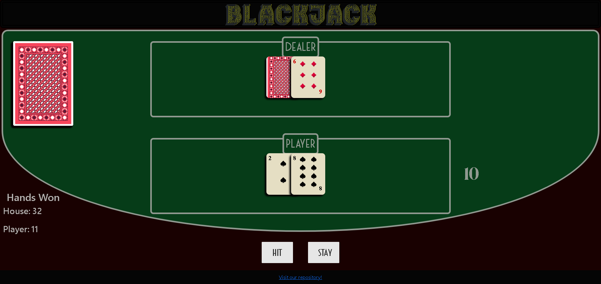
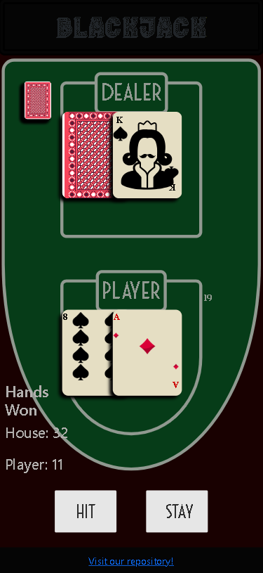

## User Story

As a player,
I want to be able to play a round of Blackjack against the dealer,
so that I can try to beat the dealer by getting a hand value of 21 or as close to it as possible without exceeding 21.

## Acceptance Criteria

Start a Game:

The player can choose to start a new round by clicking on "New Game".
The game is started with a shuffled deck and both players (the player and the dealer) are dealt two cards (the player is first dealt a face up card, then the dealer is dealt a face down card, then the rest of the 2 cards are dealt face up).

Game Play:

The player can choose to "Hit" (draw an additional card) or "Stay" (end their turn).
The player can see their current hand value at all times.
The dealer follows the rules: the dealer must "Hit" if their hand value is below 17 and must "Stay" if it's 17 or higher.

Winning and Losing:

The player wins if their hand value is closer to 21 than the dealer’s, without exceeding 21.
The player loses if their hand value exceeds 21, or if the dealer’s hand value is closer to 21.
A tie (push) occurs if the player’s and dealer’s hands are equal in value.

Card Values:

Number cards (2-10) are worth their face value.
Face cards (Jack, Queen, King) are each worth 10 points.
Aces can be worth either 1 or 11 points, depending on what is best for the player.

End of Game:

Once the round is complete (either the player stays or goes over 21, or the dealer completes their turn), the result is displayed: "You win," "You lose," or "Push."
The player is then prompted to start a new round with "New Game".

## Visit the repository

# [Github](https://github.com/Jthao04/projectOne)

## Screenshots

## Thank You

[Hearts card icon created by Freepik - Flaticon](https://www.flaticon.com/free-icons/playing-card)  
[Playing card Icons created by IconsNova - Flaticon](https://www.flaticon.com/free-icons/clubs)
